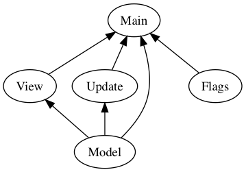

# Elm Style Guide

These are the guidelines we follow when writing [Elm](http://elm-lang.org) code at [NoRedInk](https://www.noredink.com/jobs).

Note to NoRedInkers: These conventions have evolved over time, so there will always be some parts of the code base that don't follow everything. This is how we want to write new code, but there's no urgency around changing old code to conform. Feel free to clean up old code if you like, but don't feel obliged.


## Table of Contents

* [How to Namespace Modules](#how-to-namespace-modules)
* [How to Structure Modules for A Page](#how-to-structure-modules-for-a-page)
* [Ports](#ports)
* [Model](#model)
* [Naming](#naming)
* [Function Composition](#function-composition)
* [Syntax](#syntax)
* [Code Smells](#code-smells)
* [Tooling](#tooling)


## How to Namespace Modules

### `Nri.`
`Nri.Button`, `Nri.Emoji`, `Nri.Leaderboard`

A reusable part of the site's look and feel, which could go in the visual style guide. While some parts could be made open source, these are tied directly to NRI stuff.

When adding a new abstraction to Nri, announce it on slack and seek as much feedback as possible! this will be used in multiple places.

#### Examples
- Common navigation header with configurable buttons

#### Non-examples
- `elm-css` colors and fonts should go in [here](https://github.com/NoRedInk/nri-elm-css)


### `Data.`
`Data.Assignment`, `Data.Course`, `Data.User`

Data (and functions related to that data) shared across multiple pages.

#### Examples
- Data types for a concept shared between multiple views (e.g `Data.StudentTask`)
- A type that represents a "base" type record definition. A simple example might be a `Student`, which you will then extend in `Page` (see below)
- Helpers for those data types

### `Page.`
`Page.Writing.Rate.Main`, `Page.Writing.Rate.Update`, `Page.Writing.Rate.Model.Decoder`

A page on the site, which has its own URL. These are not reusable, and implemented using a combination of types from `Data` and components from `Nri`.

The module name should follow the URL. Naming after the URL is subject to [How to Structure Modules for A Page](#how-to-structure-modules-for-a-page). The purpose of this convention is so when you have a URL, you can easily figure out where to find the module.

Comments for usage instructions aren't required, as code isn't intended to be reusable.

#### Examples
- `Page.Learn.Quiz.MultiHighlighter.Main` corresponds to the URL `/learn/quiz/:id`. In particular, the `Learn.Quiz` part corresponds to the `/learn/quiz` part. The `MultiHighlighter.Main` part is subject to [How to Structure Modules for A Page](#how-to-structure-modules-for-a-page).
- `Page.Admin.RelevantTerms.Main` corresponds to the URL `/admin/relevant_terms`. In particular, the `Admin.RelevantTerms` part corresponds to the `/admin/relevant_terms` part. The `Main` part is subject to [How to Structure Modules for A Page](#how-to-structure-modules-for-a-page).

#### Non-examples
- `Page.Teach.WritingCycles.Rate.Main` corresponds to no URL, so finding it from the URL will be hard.
- `Page.Mastery.Main` corresponds to no URL, so finding it from the URL will be hard.


### Top-level modules
`Accordion`, `Dropdown`

Something reusable that we might open source, that aren't tied directly to any NRI stuff. Name it what we'd name it if we'd already open-sourced it.

Make as much of this opensource-ready as possible:

- Must have simple documentation explaining how to use the component. No need to go overboard, but it needs to be there. Imagine you're publishing the package on elm-package! Use `--warn` to get errors for missing documentation.
- Expose Model and the Msg constructors.
- Use `type alias Model a = { a | b : c }` to allow extending of things.
- Provide an API file as example usage of the module.
- Follow either the [elm-api-component](https://github.com/NoRedInk/elm-api-components) pattern, or the [elm-html-widgets](https://github.com/NoRedInk/elm-html-widgets) pattern

#### Examples
- Filter component
- Long polling component
- Tabs component


## How to Structure Modules for A Page

Our Elm apps generally take this form:

- Main.elm
- Model.elm
- Update.elm
- View.elm
- Flags.elm

Inside **`Model.elm`**, we contain the actual model for the view state of our program. Note that we generally don't include non-view state inside here, preferring to instead generalize things away from the view where possible. For example, we might have a record with a list of assignments in our `Model` file, but the assignment type itself would be in a module called `Data.Assignment`.

**`Update.elm`** contains our update code. This includes the `Msg` types for our view. Inside here most of our business logic lives.

Inside **`View.elm`**, we define the view for our model and set up any event handlers we need.

**`Flags.elm`** contains a decoder for the flags of the app. We aim to keep our decoders basic and so decode into a special `Flags` type that mirrors the structure of the raw JSON instead of the structure of the `Model` type. The `Flags` and `Model` modules should not depend on each other.

**`Main.elm`** is our entry file. Here, we import everything from the other files and actually connect everything together.

It calls `Html.programWithFlags` with:
- `init`, defined in `Main`, runs `Flags.decodeFlags` and turns the resulting `Flags` type into a `Model`.
- `update` is `Update.update >> batchUpdate`. See [NoRedInk/rocket-update](https://github.com/NoRedInk/rocket-update) for details on `batchUpdate`.
- `view` is simply `View.view`.
- `subscriptions`, defined in `Main`, contains any subscriptions this app relies on.

Additionally we setup ports for interop with JS in this file. We run elm-make on this file to generate a JS file that we can include elsewhere.

To summarize:

- Main.elm
    - Our entry point. Decodes the flags, creates the initial model, calls `Html.programWithFlags` and sets up ports.
    - Compile target for `elm-make`
    - Imports `Model`, `Update`, `View` and `Flags`.

- Model.elm
    - Contains the `Model` type for the view alone.
    - Imports nothing but generalized types that are used in the model
    - Exports `Model`

- Update.elm
    - Contains the `Msg` type for the view, and the update function.
    - Imports `Model`
    - Exports `update : Msg -> Model -> (Model, List (Cmd Msg))` and `Msg`

- View.elm
    - Contains the view code
    - Imports `Model` and `Update` (for the `Msg` types)
    - Exports `view : Model -> Html Msg`

- Flags.elm
    - Contains the flags decoder
    - Imports nothing but generalized decoders.
    - Exports `Flags`, `decodeFlags : String -> Result String Flags`



## Ports

### All ports should bring things in as `Json.Value`

The single source of runtime errors that we have right now are through ports receiving values they shouldn't. If a `port something : Signal Int` receives a float, it will cause a runtime error. We can prevent this by just wrapping the incoming things as `Json.Value`, and handle the errorful data through a `Decoder` result instead.

### Ports should always have documentation

I don't want to have to go out from our Elm files to find where a port is being used most of the time. Simply adding a line or two explaining what the port triggers, or where the values coming in from a port can help a lot.


## Model

### Model shouldn't have _any_ view state within them if they aren't tied to views

For example, an assignment should not have a `openPopout` attribute. Doing so means we can't use that type again in another situation.


## Naming

### Use descriptive names instead of tacking on underscores

Instead of this:

```elm
-- Don't do this --
markDirty model =
  let
    model_ =
      { model | dirty = True }
  in
    model_
```

...just come up with a name.

```elm
-- Instead do this --
markDirty model =
  let
    dirtyModel =
      { model | dirty = True }
  in
    dirtyModel
```

## Function Composition

### Use pipes `|>` over backticks

Instead of this:

```elm
-- Don't do this --
saveAccounts (List.map deactivateAccount accounts)
  `andThen` (\response -> sendToLogger response.successMessage)
```

...use [`|>`](http://package.elm-lang.org/packages/elm-lang/core/latest/Basics#|>) and qualified names like normal, and use [`flip`](http://package.elm-lang.org/packages/elm-lang/core/latest/Basics#flip) to obtain the desired argument order.

```elm
-- Instead do this --
accounts
  |> List.map deactivateAccount
  |> saveAccounts
  |> Task.andThen (\response -> sendToLogger response.successMessage)
```

### Use anonymous function [`\_ ->`](http://elm-lang.org/docs/syntax#functions) over [`always`](http://package.elm-lang.org/packages/elm-lang/core/latest/Basics#always)

It's more concise, more recognizable as a function, and makes it easier to change your mind later and name the argument.

```elm
-- Don't do this --
on "click" Json.value (always (Signal.message address ()))
```

```elm
-- Instead do this --
on "click" Json.value (\_ -> Signal.message address ())
```

### Only use backward function application [`<|`](http://package.elm-lang.org/packages/elm-lang/core/latest/Basics#<|) when parens would be awkward

Instead of this:

```elm
-- Don't do this --
foo <| bar <| baz qux
```

...prefer using parentheses, because they'd look fine:

```elm
-- Instead do this --
foo (bar (baz qux))
```

However this would be awkward:

```elm
-- Don't do this --
customDecoder string
  (\str ->
    case str of
      "one" ->
        Result.Ok 1

      "two" ->
        Result.Ok 2

      "three" ->
        Result.Ok 3
    )
```

...so prefer this instead:

```elm
-- Instead do this --
customDecoder string
  <| \str ->
      case str of
        "one" ->
          Result.Ok 1

        "two" ->
          Result.Ok 2

        "three" ->
          Result.Ok 3
```

### Always use [`Json.Decode.Pipeline`](https://github.com/NoRedInk/elm-decode-pipeline) instead of [`mapN`](http://package.elm-lang.org/packages/elm-lang/core/latest/Json-Decode#map2)

Even though this would work...

```elm
-- Don't do this --
algoliaResult : Decoder AlgoliaResult
algoliaResult =
  map6 AlgoliaResult
    (field "id" int)
    (field "name" string)
    (field "address" string)
    (field "city" string)
    (field "state" string)
    (field "zip" string)
```

...it's inconsistent with the longer decoders, and must be refactored if we want to add more fields.

Instead do this from the start:

```elm
-- Instead do this --
import Json.Decode.Pipeline exposing (required, decode)

algoliaResult : Decoder AlgoliaResult
algoliaResult =
  decode AlgoliaResult
    |> required "id" int
    |> required "name" string
    |> required "address" string
    |> required "city" string
    |> required "state" string
    |> required "zip" string
```

This will also make it easier to add [optional fields](http://package.elm-lang.org/packages/NoRedInk/elm-decode-pipeline/latest/Json-Decode-Pipeline#optional) where necessary.

[json2elm](http://json2elm.org/) can generate pipeline-style decoders from
raw JSON.

## Syntax

### Use `case..of` over `if` where possible

`case..of` is clever as it will generate more efficent JS, and it also allows you to catch unmatched patterns at compile time. It's also cheap to extend this data with something more useful later on, like if you need to add another branch. This saves code diffs.


## Code Smells

### If a module has a looong list of imports, consider refactoring

Having complicated imports hurts our compile time! I don't know what to say about this other than if you feel that there's something wrong with the top 40 lines of your module because of imports, then it might be time to move things out into another module. Trust your gut.

### If a function can be pulled outside of a let binding, then do it

Giant let bindings hurt readability and performance. The less nested a function, the less functions are used in generated code.

The update function is especially prone to get longer and longer: keep it as small as possible. Smaller functions that don't live in a let binding are more reusable.

### If your application has too many constructors for your Msg type, consider refactoring

Large `case..of` statements hurts compile time. It might be possible that some of your constructors can be combined, for example `type Msg = Open | Close` could actually be `type Msg = SetOpenState Bool`


## Tooling

### Use [`elm-init-scripts`](https://github.com/NoRedInk/elm-init-scripts) to start your projects

This will generate all the files mentioned [above](#how-to-structure-modules-for-a-page) for you.

### Use [`elm-ops-tooling`](https://github.com/NoRedInk/elm-ops-tooling) to manage your projects

In particular, use `elm_deps_sync` to keep your main elm-package.json in sync with your test elm-package.json.

### Use [`elm-format`](https://github.com/avh4/elm-format) on all files

We run the latest version of [`elm-format`](https://github.com/avh4/elm-format) to get uniform syntax formatting on our source code.

This has [several benefits](https://github.com/avh4/elm-format#elm-format),
not the least of which is that it renders many potential style discussions moot,
making it easier to spend more time building things!
